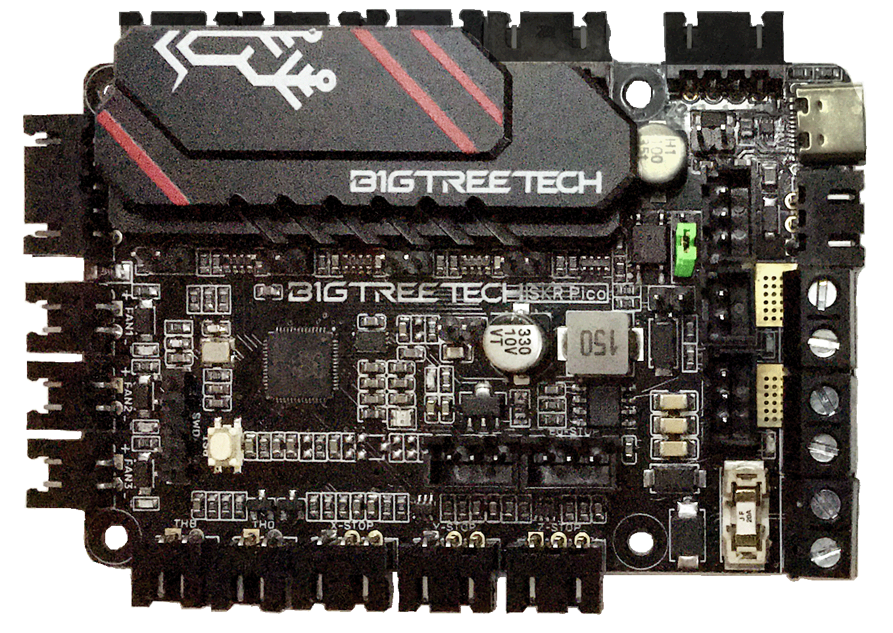
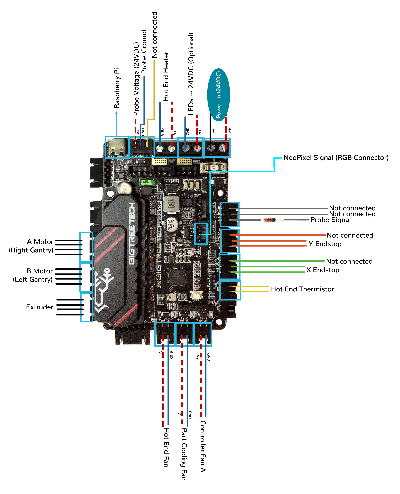
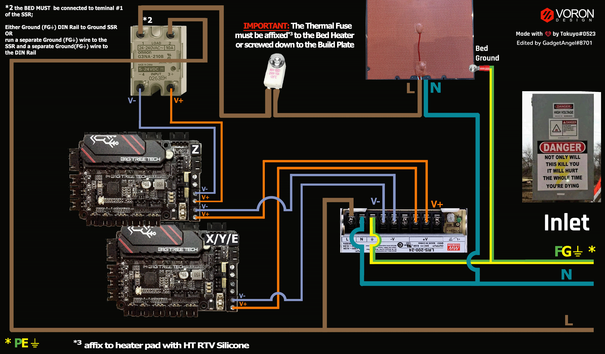

# Trident - BTT SKR Pico Wiring

## Initial Removal of Jumpers

* The BTT SKR Pico will arrive without any jumpers being set.

## Initial Preparation - Set Jumpers

* Set the on-board jumper, located at the position as shown by the **GREEN** jumper in the diagram below:

######  {#v2tri_SKR_PICO_V1.0_PREP_tri}

* If you want to open the above picture, in a new tab of your web browser, then [click here](./images/v2tri_SKR_PICO_V1.0_PREP.png){:target="_blank" rel="noopener"}

## Voltage Selection Header and Other Headers

* Ensure the **removal of the SW_USB 5V power supply jumper ("SW_USB header, shown in the PURPLE box")** which avoids the interaction between the USB 5V of Raspberry Pi and the DC-DC 5V of the motherboard.

* In the diagram below, ensure **all of "DIAG Jumpers" (shown in the ORANGE boxes) are removed** to avoid the influence of TMC2209 DIAG on the endstops.

* **Set the SELECT-PROXIMITY-I/O-PIN jumper (shown in the YELLOW box).**  This SELECT-PROXIMITY-I/O-PIN jumper selects which connector uses IO22 pin (either connector PS or PROBE). Even tho the Voron printer does not use the dedicated PROBE connector for its proximity sensor (inductive probe), set this jumper for the PROBE connector.

* Ensure the **removal of the SELECT-PROXIMITY-STYLE jumper (shown in the RED box).** Since the Voron printer does not use the dedicated probe connector, ensure this header is empty.

__IMPORTANT:__ **Double check all the** __GREEN__ **jumpers are set appropriately, especially the jumpers called out by the _COLORED BOXES_, BEFORE the power supply is connected.**

######  {#v2tri_SKR_PICO_V1.0_voltageselect_tri}

* If you want to open the above picture, in a new tab of your web browser, then [click here](./images/v2tri_SKR_PICO_V1.0_voltageselect.png){:target="_blank" rel="noopener"}

## MCU X/Y/E, Hot End

* - [ ] Connect 24V and GND (V+ and V-) from the PSU to POWER/DCIN
* - [ ] Plug in stepper motor for the B Motor (gantry left) into position X (motor connector)
* - [ ] Plug in stepper motor for the A Motor (gantry right) into position Y (motor connector)
* - [ ] Plug in stepper motor for the extruder motor into position E (motor connector)
* - [ ] Plug hot end thermistor to thermistor TH0 (IO27)
* - [ ] Plug hot end heater in to HE (IO23)
* - [ ] Plug hot end fan in to FAN1 (IO17)
* - [ ] Plug part cooling fan in to FAN2 (IO18)
* - [ ] Plug controller fan A in to FAN3 (IO20)
* - [ ] Connect X end stop to X-STOP connector (IO4)
* - [ ] Connect Y end stop to Y-STOP connector (IO3)
* - [ ] Connect the Probe Signal (with&nbsp;**BAT85 diode**) to Z-STOP connector (IO25)
* - [ ] Connect the V+ an 0V wires on the probe to LASER
* - [ ] Connect USB Cable to your SKR Pico,&nbsp;**but do not connect it yet to your Raspberry Pi**

BAT85
: a Schottky barrier diode. BAT85 is needed to protect the SKR board (MCU board) from being fried.  An Inductive Probe device (Omron TL-Q5MC2; Omron TL-Q5MC2-Z or Panasonic GX-HL15BI-P) communicates at a much higher voltage level (10V - 30V) then the MCU board.  The BAT85 is used to protect the input signal PIN of the MCU board; without the BAT85 the MCU board will be damaged.  If two BAT85s are used in series, the circuit will protect the MCU board and still allow the inductive probe to function properly. [For more information, click here](./index#bat85-diode){:target="_blank" rel="noopener"}

### MCU X/Y/E, Hot End Wiring Diagram

######  {#V2Tri_Wiring_Diagram_BTT_PICO_XYE_UART_tri}

* If you want to open the above diagram, in a new tab of your web browser, and have the ability to zoom and download the diagram in JPG format then [click here](./images/V2Tri_Wiring_Diagram_BTT_PICO_XYE_UART.jpg){:target="_blank" rel="noopener"}

## MCU Z, Bed, Exhaust Fan

* - [ ] Connect 24V and GND (V+ and V-) from the PSU to POWER/DCIN
* - [ ] Plug in stepper motor for the Z into positions E (motor connector)
* - [ ] Plug in stepper motor for the Z1 into positions X (motor connector)
* - [ ] Plug in stepper motor for the Z2 into positions Y (motor connector)
* - [ ] Plug heated bed thermistor in to THB (IO26)
* - [ ] Connect the bed SSR (DC Control Side) to HB (IO21)
* - [ ] Connect the chamber exhaust fan to FAN1 (IO17)
* - [ ] Connect the controller fan B in to FAN2 (IO18)
* - [ ] Connect Z end stop to Z-STOP connector (IO25)
* - [ ] Connect USB Cable to your SKR Pico,&nbsp;**but do not connect it yet to your Raspberry Pi**

### MCU Z, Bed, Exhaust Fan Wiring Diagram

######  {#tri_Wiring_Diagram_BTT_PICO_Z_UART2_tri}

* If you want to open the above diagram, in a new tab of your web browser, and have the ability to zoom and download the diagram in JPG format then [click here](./images/Trident_Wiring_Diagram_BTT_PICO_Z_UART2.jpg){:target="_blank" rel="noopener"}

## Powering the Raspberry Pi & Setting up UART Communications with the Raspberry Pi

* see [the SKR Pico's Raspberry Pi Section](./skr_pico_RaspberryPi#raspberry-pi){:target="_blank" rel="noopener"}

## SSR Wiring

* Wire colors will vary depending on your locale.

######  {#SKRpicoUART-ssr-wiring_tri}

* If you want to open the above diagram, in a new tab of your web browser, and have the ability to zoom and download the diagram in PNG format then [click here](./images//SKRpicoUART-ssr-wiring.png){:target="_blank" rel="noopener"}

<!--### The Klipper Configuration file for SKR Pico board

The Klipper Configuration file from VoronDesign/Voron-2 GitHub Repo for SKR Pico board is [located here](https://raw.githubusercontent.com/VoronDesign/Voron-2/Voron2.4/firmware/klipper_configurations/SKR_1.3/Voron2_SKR_13_Config.cfg){:target="_blank" rel="noopener"};
-->

## URL Resources Links for the SKR Pico (PIN Diagrams and Repo)

* see [The SKR Pico Resource Section](./skr_pico_Resources#color-pin-diagram-for-skr-pico){:target="_blank" rel="noopener"}

## After I have Wired up the MCU Board, What Comes Next?

1. Once the MCU board is wired up and wire management has been performed, the next step is to install Mainsail/Fluidd or Octoprint, please see [The Build ═► Software Installation](../../build/software/index#software-installation){:target="_blank" rel="noopener"}

2. Once Mainsail/Fluidd or Octoprint has been installed, the next step is to **compile and install** the Klipper Firmware, please use the [ Color Pin Diagram, look for "Klipper Building Options"](./images/SKR_PICO_V1.0_Color_PIN_diagram.pdf){:target="_blank" rel="noopener"}; an alternative source of information on how to build and install the Klipper firmware for the SKR Pico is [located here](https://github.com/bigtreetech/SKR-Pico/tree/master/Klipper#how-to-use-klipper-on-skr-pico-v10){:target="_blank" rel="noopener"}

3. Once the MCU board has the Klipper Firmware Installed, the next step is to **create** the Klipper Config file (create printer.cfg file);

    * Please use the Color PIN Diagrams, [displayed here](./skr_pico_Resources#color-pin-diagram-for-skr-pico){:target="_blank" rel="noopener"}, as a source of information.

    * Please consult [The Build ═► Software Configuration](../../build/software/configuration#software-configuration){:target="_blank" rel="noopener"} on how to edit the Klipper Config file.

4. After **creating** the Klipper Config file (printer.cfg), the next step is to check all the Motors and the mechanics of the Voron printer, please see [The Build ═► Initial Startup Checks](../../build/startup/index#initial-startup-checks){:target="_blank" rel="noopener"}

