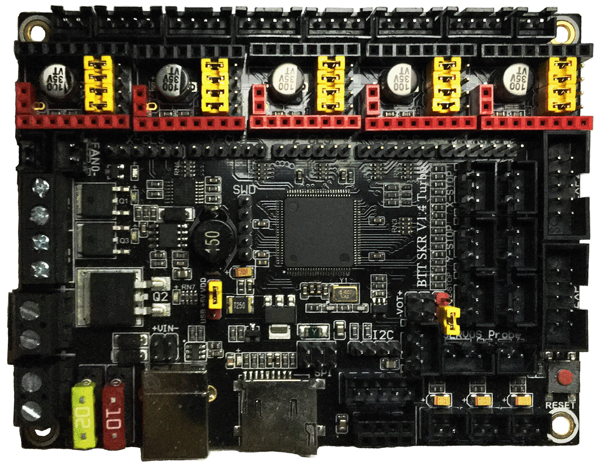
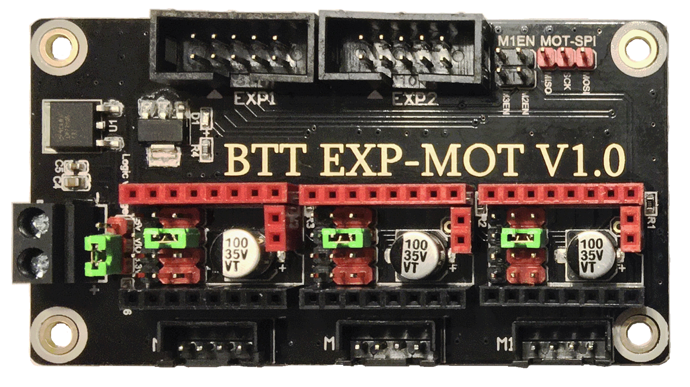
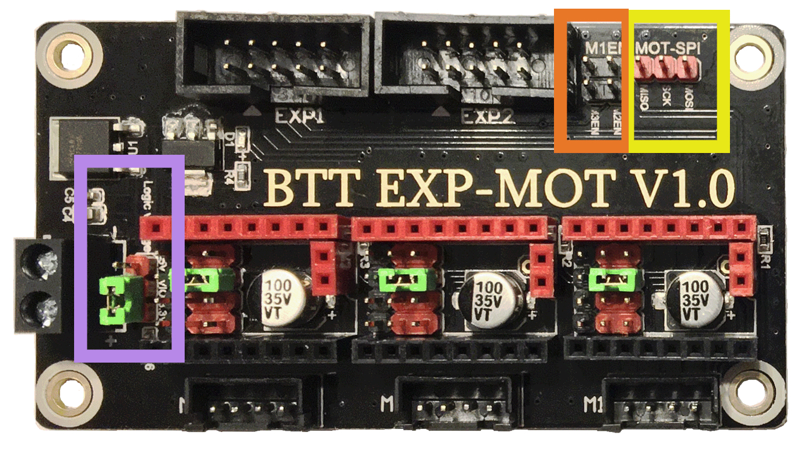
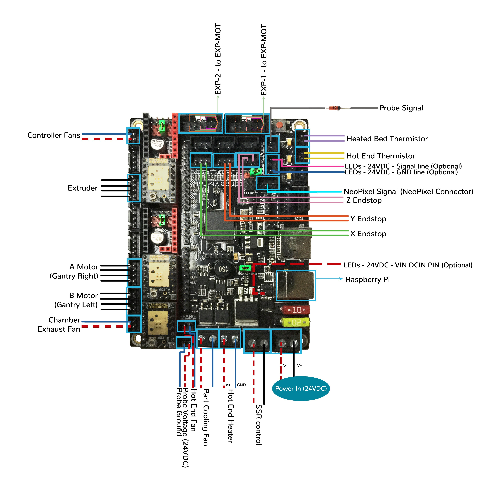
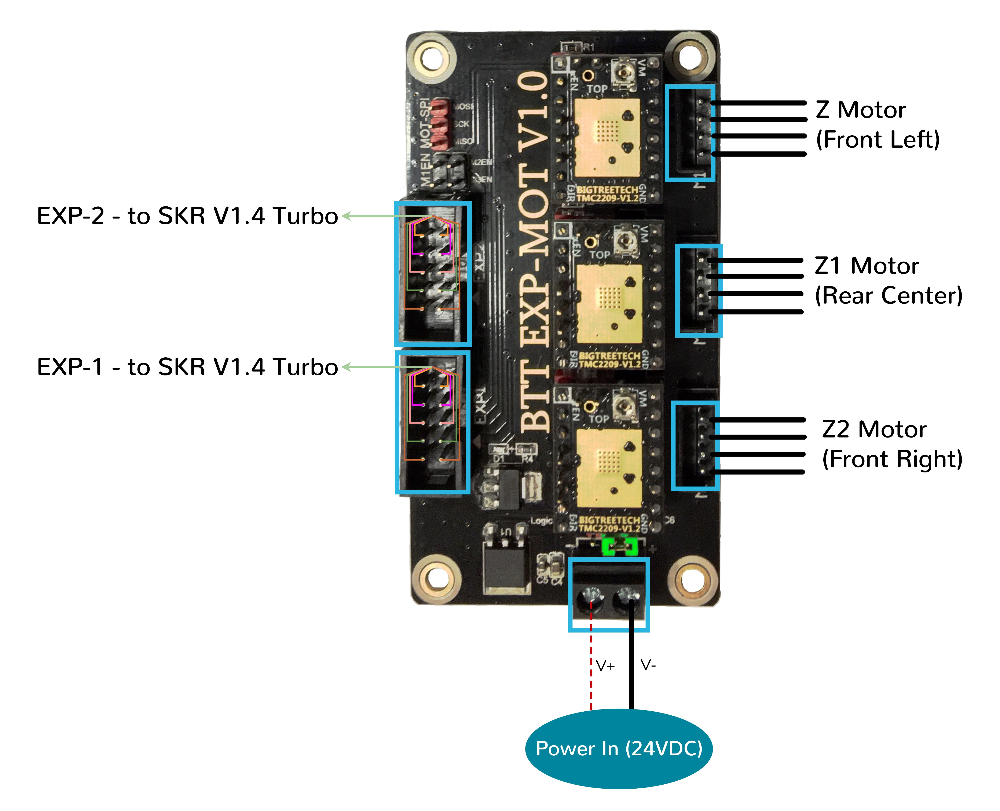
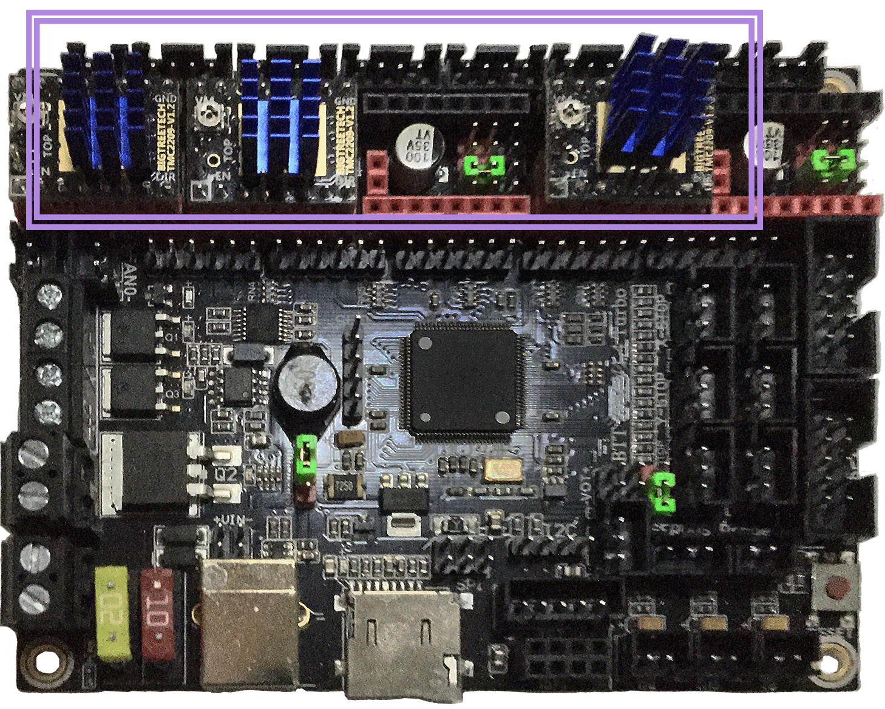
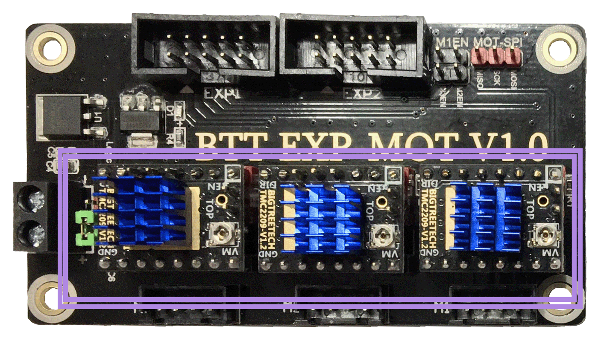
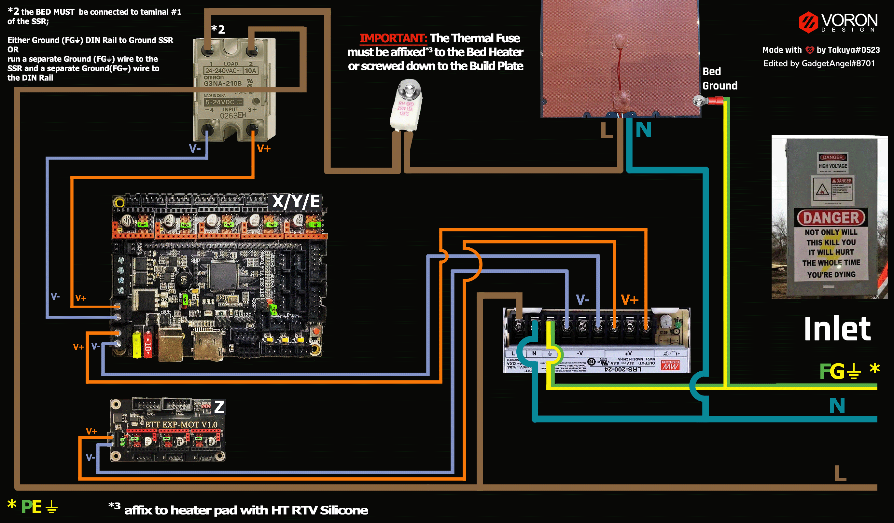

# Trident - SKR V1.4/Turbo and EXP-MOT using: TMC2208, TMC2209, TMC2225, or TMC2226

## Initial Preparation Needed for TMC2209 and TMC2226 UART Stepper Motor Drivers
   

* see [the Initial Preparation for UART TMC Drivers](./init_prep_tmc_drvs_uart#preparation-of-tmc2209-and-tmc2226-uart-stepper-motor-drivers){:target="_blank" rel="noopener"}

## Initial Removal of Jumpers for the SKR V1.4/Turbo in UART Mode

Remove **all YELLOW** on-board jumpers, located at the positions shown below:

######  {#v2_skrv14_PREP-removal_uart_triskr-expmot}

## Initial Removal of Jumpers for the EXP-MOT in UART Mode

Remove **all YELLOW** on-board jumpers, located at the positions shown below:

######  {#tri_EXP-MOT-V10_PREP-removal_uart_triskr-expmot}

## Initial Preparation for the SKR V1.4/Turbo in UART Mode - Set Jumpers

* Set the on-board jumpers, located at the positions as shown by the **GREEN** jumpers in the diagram below:

######  {#v2_skr14T_UART_PREP_triskr-expmot_1}

## Initial Preparation for the EXP-MOT in UART Mode - Set Jumpers

* Set the on-board jumpers, located at the positions as shown by the **GREEN** jumpers in the diagram below:

######  {#tri_EXP-MOT-V10_UART_PREP_triskr-expmot_1}

### Voltage Selection Headers for the SKR V1.4/Turbo in UART mode

* **Set the USB-PWR jumper to the VDD position (as shown in the PURPLE box)** to avoid the interaction between the USB 5V of Raspberry Pi and the DC-DC 5V of the motherboard.

* The NPWR jumper setting will decide the source of the board's NeoPixel connector's +V PIN.  The NeoPixel connector can be sourced from the board itself or from an external DCDC bridge module.  One can purchase an external DCDC bridge module (sold separately) to power 5V NeoPixel LEDs.  This bridge module is called the "DCDC Mode V1.0" board. Since the Voron printer does not require the extra DCDC bridge module, **set the NPWR jumper to indicate that the DCDC bridge module is not attached to the board, as shown in the ORANGE box on the diagram below.**

__IMPORTANT:__ **Double check all the** __GREEN__ **jumpers are set appropriately, especially the jumpers called out by the _COLORED BOXES_, BEFORE the power supply is connected.**

######  {#v2_skr14T_UART_voltageselect_triskr-expmot}

### Voltage Selection Header for the EXP-MOT in UART mode

* **Set the LOGIC-VOLTAGE jumper to the 3.3V position (as shown in the PURPLE box)** since the SKR board is a 32-bit processor which uses 3.3V logic level for the stepper motor driver boards.

* Ensure the removal of jumpers on the M1EN header (as shown in the **ORANGE box**). Again, the M1EN header must be empty.

* Ensure the removal of jumpers on the MOT-SPI header (as shown in the **YELLOW box**). Again, the MOT-SPI header must be empty for UART mode to work properly.

__IMPORTANT:__ **Double check all the** __GREEN__ **jumpers are set appropriately, especially the jumpers called out by the _COLORED BOXES_, BEFORE the power supply is connected.**

######  {#tri_EXP-MOT-V10_UART_voltageselect_triskr-expmot}

## Stepper Motor Drivers for both SKR V1.4/Turbo and EXP-MOT
* Inspect the stepper motor drivers for left over rosin, and clean with IPA, if needed
* Install heat sinks on all stepper motor drivers

## MCU X/Y/E, Hot End, Bed, and Exhaust Fan in UART Mode (SKR V1.4/Turbo)

* - [ ] Connect 24V and GND (V+ and V-) from the PSU to Power/DCIN
* - [ ] Connect stepper driver for the B Motor (gantry left) into position X driver socket
* - [ ] Plug in stepper motor for the B Motor (gantry left) into position X motor connector
* - [ ] Connect stepper driver for the A Motor (gantry right) into position Y driver socket
* - [ ] Plug in stepper motor for the A Motor (gantry right) into position Y motor connector
* - [ ] Connect stepper driver for the extruder motor into position E0 driver socket
* - [ ] Plug in stepper motor for the extruder motor into position E0 motor connector
* - [ ] Connect the hot end heater to HE0 (P2.7)
* - [ ] Connect the bed SSR (DC Control Side) to HB (P2.5)
* - [ ] Connect the part cooling fan to HE1 (P2.4)
* - [ ] Connect the hot end fan to FAN0 (P2.3)
* - [ ] Connect the controller fans to FAN2
* - [ ] Connect the chamber exhaust fan to FAN3
* - [ ] Connect the hot end thermistor to TH0 (P0.24)
* - [ ] Connect the heated bed thermistor to TB (P0.25)
* - [ ] Connect the X endstop to X-STOP (P1.29)
* - [ ] Connect the Y endstop to Y-STOP (P1.28)
* - [ ] Connect the Z endstop to Z-STOP (P1.27)
* - [ ] Connect the Probe Signal (with&nbsp;**BAT85 diode**) to PROBE connector (P0.10)
* - [ ] Connect the Probe PWR and GND to FAN1
* - [ ] Plug the supplied ribbon cable into EXP1 on the SKR V1.4/Turbo board and then plug the other end into the EXP1 on the EXP-MOT board.
* - [ ] Plug the supplied ribbon cable into EXP2 on the SKR V1.4/Turbo board and then plug the other end into the EXP2 on the EXP-MOT board.
* - [ ] Connect USB Cable to your SKR 1.4/1.4Turbo,&nbsp; **but do not connect it yet to your Raspberry Pi**

BAT85
: a Schottky barrier diode. BAT85 is needed to protect the SKR board (MCU board) from being fried.  An Inductive Probe device (Omron TL-Q5MC2; Omron TL-Q5MC2-Z or Panasonic GX-HL15BI-P) communicates at a much higher voltage level (10V - 30V) then the MCU board.  The BAT85 is used to protect the input signal PIN of the MCU board; without the BAT85 the MCU board will be damaged.  If two BAT85s are used in series, the circuit will protect the MCU board and still allow the inductive probe to function properly. [For more information, click here](https://docs.vorondesign.com/build/electrical/#bat85-diode){:target="_blank" rel="noopener"}

### MCU X/Y/E, Hot End, Bed, and Exhaust Fan in UART mode Wiring Diagram (SKR V1.4/Turbo)

######  {#Trident_Wiring_Diagram_SKRV1.4TurboandEXP-MOT_XYE_UART_triskr-expmot}

* If you want to open the above diagram, in a new tab of your web browser, and have the ability to zoom and download the diagram in JPG format then [click here](./images/Trident_Wiring_Diagram_SKRV1.4TurboandEXP-MOT_XYE_UART.jpg){:target="_blank" rel="noopener"}

## MCU Z in UART Mode (EXP-MOT)

* - [ ] Connect 24V and GND (V+ and V-) from the PSU to Power_In/DCIN
* - [ ] Connect stepper driver for the Z into positions M1 driver socket
* - [ ] Plug in stepper motor for the Z into positions M1 motor connector
* - [ ] Connect stepper driver for the Z1 into positions M2 driver socket
* - [ ] Plug in stepper motor for the Z1 into positions M2 motor connector
* - [ ] Connect stepper driver for the Z2 into positions M3 driver socket
* - [ ] Plug in stepper motor for the Z2 into positions M3 motor connector

### MCU Z in UART Mode Wiring Diagram (EXP-MOT)

######  {#Trident_Wiring_Diagram_SKRV1.4TurboandEXP-MOT_Z_UART_triskr-expmot}

* If you want to open the above diagram, in a new tab of your web browser, and have the ability to zoom and download the diagram in JPG format then [click here](./images/Trident_Wiring_Diagram_SKRV1.4TurboandEXP-MOT_Z_UART.jpg){:target="_blank" rel="noopener"}

[Go Back to the Table of Contents](./tri_skrv14_exp-mot_wiring#trident---btt-skr-v14turbo-and-exp-mot-wiring)

## Please Ensure the Heat Sinks are Installed Before Use on Both the SKR V1.4/Turbo and EXP-MOT boards

Note on the Orientation of the Stepper Motor Driver's Heat Sinks
: Place the heat sinks for the stepper motor drivers so that the orientation of the fins on the heat sinks are parallel to the air flow from the controller fans once the MCU board is installed on the DIN rail. Ensure the heat sinks are **not touching** the solder joints located on the top of the step stick. Please note, that your placement of heat sinks may be different from the orientation shown below.

### MCU X/Y/E, Hot End, Bed, and Exhaust Fan with Heat Sinks Installed (SKR V1.4/Turbo)

######  {#v2_skr14T_XYE_UART_heatsinks1_triskr-expmot}

### MCU Z with Heat Sinks Installed (EXP-MOT)

######  {#tri_EXP-MOT-V10_UART_heatsinks2_triskr-expmot}

## Raspberry Pi

### Power

* The BTT SKR V1.4/Turbo board is **NOT capable of providing 5V power** to run your Raspberry Pi.

## Setting up UART Communications with the Raspberry Pi

* see [the SKR V1.4/Turbo Raspberry Pi Section](./skrv14_RaspberryPi#raspberry-pi){:target="_blank" rel="noopener"}

## SSR Wiring (SKR V1.4/Turbo Board Shown is in UART mode)

* Wire colors will vary depending on your locale.

######  {#Trident_SKRV1.4andEXP-MOTinUART-ssr-wiring_triskr-expmot}

* If you want to open the above diagram, in a new tab of your web browser, and have the ability to zoom and download the diagram in PNG format then [click here](./images/Trident_SKRV1.4andEXP-MOTinUART-ssr-wiring.png){:target="_blank" rel="noopener"}

[Go Back to the Table of Contents](./tri_skrv14_exp-mot_wiring#trident---btt-skr-v14turbo-and-exp-mot-wiring)

### The Klipper Configuration file for SKR V1.4/Turbo board with the EXP-MOT board

The Klipper Configuration file from VoronDesign/Voron-Trident GitHub Repo for SKR V1.4/Turbo board using the EXP-MOT board is [located here](https://raw.githubusercontent.com/VoronDesign/Voron-Trident/main/Firmware/Voron_Trident_SKR14_EXPMOT.cfg){:target="_blank" rel="noopener"};

[Go Back to the Table of Contents](./tri_skrv14_exp-mot_wiring#trident---btt-skr-v14turbo-and-exp-mot-wiring)

## URL Resources Links for the SKR V1.4/Turbo (PIN Diagrams and Repo)

* see [The SKR V1.4/Turbo Resource Section](./skrv14_Resources#color-pin-diagram-for-skr-v14v14turbo){:target="_blank" rel="noopener"}

## URL Resources Links for the BTT EXP-MOT V1.0 (PIN Diagrams and Repo)

* see [The EXP-MOT V1.0 Resource Section](./exp-motv10_Resources#original-exp-mot-v10-pinout){:target="_blank" rel="noopener"}

## After I have Wired up the MCU Board and EXP-MOT Board, What Comes Next?

1. Once the MCU board and EXP-MOT board are wired up and wire management has been performed, the next step is to install Mainsail/Fluidd or Octoprint, please see [The Build ═► Software Installation](../../build/software/index#software-installation){:target="_blank" rel="noopener"}

2. Once Mainsail/Fluidd or Octoprint has been installed, the next step is to **compile and install** the Klipper Firmware onto the SKR V1.4/Turbo board only (the EXP-MOT board does not have a microprocessor), please see [The Build ═► Software Installation -> Firmware Flashing(Header) -> SKR 1.4](../../build/software/skr13_klipper#skr-1314-klipper-firmware){:target="_blank" rel="noopener"}

3. Once the MCU board has the Klipper Firmware Installed, the next step is to **create/edit** the Klipper Config file (Voron_Trident_SKR14_EXPMOT.cfg rename it to printer.cfg) to ensure your Voron build matches your Klipper Config file, please see [the file located here](https://raw.githubusercontent.com/VoronDesign/Voron-Trident/main/Firmware/Voron_Trident_SKR14_EXPMOT.cfg){:target="_blank" rel="noopener"};

    * Please use the SKR V1.4/Turbo Color PIN Diagram, [displayed here](./skrv14_Resources#color-pin-diagram-for-skr-v14v14turbo){:target="_blank" rel="noopener"}, as a source of information;

    * Please use the Original EXP-MOT PIN Diagram, [displayed here](./exp-motv10_Resources#Original-PIN-diagram-exp-mot){:target="_blank" rel="noopener"}, as a source of additional information;

    * Please consult [The Build ═► Software Configuration](../../build/software/configuration#software-configuration){:target="_blank" rel="noopener"} on how to edit the Klipper Config file.

4. After **creating/editing** the Klipper Config file (Voron_Trident_SKR14_EXPMOT.cfg renamed to printer.cfg), the next step is to check all the Motors and the mechanics of the Voron printer, please see [The Build ═► Initial Startup Checks](../../build/startup/index#initial-startup-checks){:target="_blank" rel="noopener"}

[Go Back to the Table of Contents](./tri_skrv14_exp-mot_wiring#trident---btt-skr-v14turbo-and-exp-mot-wiring)