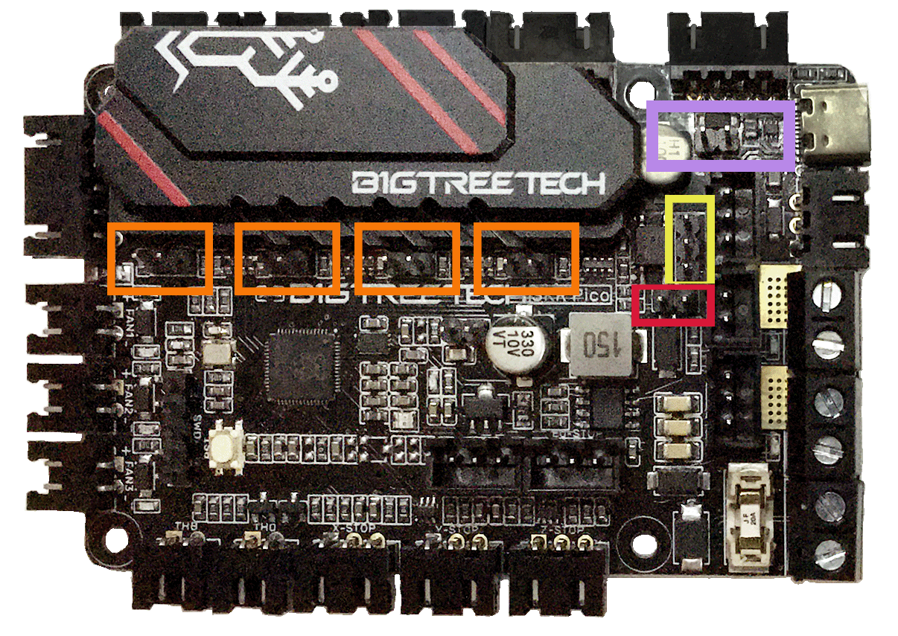
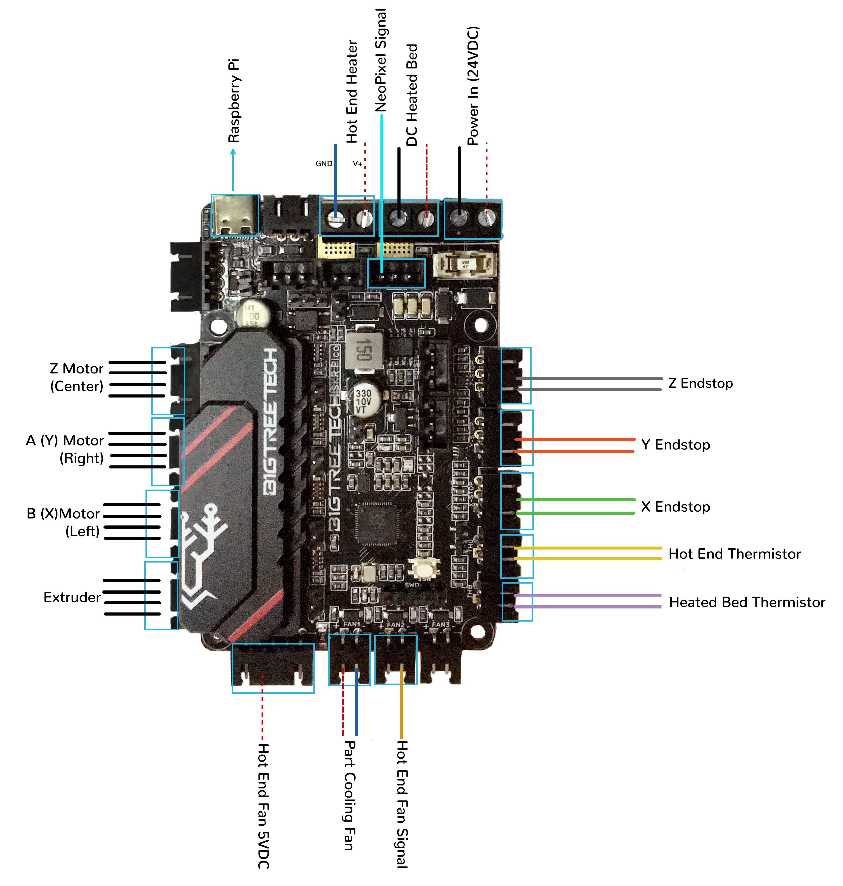

# Voron V0.1 - SKR Pico Wiring

## Initial Removal of Jumpers

* The BTT SKR Pico will arrive without any jumpers being set.

## Initial Preparation - Set Jumpers

* **All** Jumpers should be **removed** from the SKR Pico board.

* Ensure the **removal of the USB 5V power supply jumper ("SW_USB Selection Jumper, shown in the RED box")** which avoids the interaction between the USB 5V of Raspberry Pi and the DC-DC 5V of the motherboard.

######  {#SKR_PICO_V1.0_voltageselect}

## MCU

* Plug in stepper motors for X, Y, Z, and E in positions X, Y, Z1, and E
* Plug Hot End thermistor to thermistor TH0 (IO27)
* Plug Hot End heater in to HE (IO23)
* Plug Hot End Fan Signal in to FAN2 (IO18)
* Plug Hot End Fan V+ (+5VDC) in to "LASER" connector's 5V PIN
* Plug Part Cooling Fan in to FAN1 (IO17)
* Plug Bed Thermistor in to THB (IO26)
* Connect The DC bed to HB (IO21)
* Connect X end stop to X-STOP connector (IO4)
* Connect Y end stop to Y-STOP connector (IO3)
* Connect Z end stop to Z-STOP connector (IO25)
* Wire 24V and -V from DC power supply to POWER
* Connect USB Cable to your SKR Pico, **but do not connect it yet to your Raspberry Pi**

### MCU Diagram

######  {#Voron0.1_Wiring_Diagram_SKR_PICO}

* If you want to open the above diagram, in a new tab of your web browser, and have the ability to zoom and download the diagram in JPG format then [click here](./images/Voron0.1_Wiring_Diagram_SKR_PICO_V1.0.jpg){:target="_blank" rel="noopener"}

### The Klipper Configuration file for SKR Pico board
   
The Klipper Configuration file from VoronDesign/Voron-0 GitHub Repo, Voron0.1 branch for SKR Pico board is [located here](https://github.com/VoronDesign/Voron-0/blob/Voron0.1/Firmware/skr-pico-v1.0.cfg){:target="_blank" rel="noopener"}

## Color PIN Diagram for SKR Pico

For reference, here is the Color PIN diagram for the SKR Pico
   

######  {#SKR_PICO_V1.0_Color_PIN_diagram}

* If you want to open the above diagram, in a new tab of your web browser, and have the ability to zoom and download the diagram in PDF format then [click here](./images/SKR_PICO_V1.0_Color_PIN_diagram.pdf){:target="_blank" rel="noopener"}

* If you want to open the above diagram, in a new tab of your web browser, and have the ability to zoom and download the diagram in JPG format then [click here](./images/SKR_PICO_V1.0_Color_PIN_diagram.jpg){:target="_blank" rel="noopener"}

## Original SKR Pico Pinout
   
For reference, here is the original pinout of the SKR Pico

* Note: If you see a conflict between the original pinout and any other source, please refer back to the [BigTreeTech SKR Pico schematic diagram](<./images/BTT SKR Pico V1.0-SCH.pdf>){:target="_blank" rel="noopener"}
   

######  {#skr-pico-pinout}

* If you want to open the above diagram, in a new tab of your web browser, and have the ability to zoom and download the diagram in PDF format then [click here](<./images/BTT SKR Pico V1.0-PIN.pdf>){:target="_blank" rel="noopener"}

## The BTT's GitHub Repo for the SKR Pico Board

* BigTreeTech documentation for SKR Pico board is [located here](https://github.com/bigtreetech/SKR-Pico){:target="_blank" rel="noopener"}

## After I have Wired up the MCU Board, What Comes Next?

1. Once the MCU board is wired up and wire management has been performed, the next step is to install Mainsail/Fluidd or Octoprint, please see [The Build ═► Software Installation](../../build/software/index#software-installation){:target="_blank" rel="noopener"}

2. Once Mainsail/Fluidd or Octoprint has been installed, the next step is to **compile and install** the Klipper Firmware, please use the [above Color Pin Diagram, look for "Klipper Building Options"](./images/SKR_PICO_V1.0_Color_PIN_diagram.pdf){:target="_blank" rel="noopener"}

3. Once the MCU board has the Klipper Firmware Installed, the next step is to **create/edit** the Klipper Config file (skr-pico-v1.0.cfg rename it to printer.cfg) to ensure your Voron build matches your Klipper Config file, please see [the file located here;](https://raw.githubusercontent.com/VoronDesign/Voron-0/Voron0.1/Firmware/skr-pico-v1.0.cfg){:target="_blank" rel="noopener"};

    * Please use the Color PIN Diagrams, [displayed above](#color-pin-diagram-for-skr-pico), as a source of information.

    * Please consult [The Build ═► Software Configuration](../../build/software/configuration#software-configuration){:target="_blank" rel="noopener"} on how to edit the Klipper Config file.

4. After **creating/editing** the Klipper Config file (skr-pico-v1.0.cfg renamed to printer.cfg), the next step is to check all the motors and the mechanics of the Voron printer, please see [The Build ═► Initial Startup Checks](../../build/startup/index#initial-startup-checks){:target="_blank" rel="noopener"}