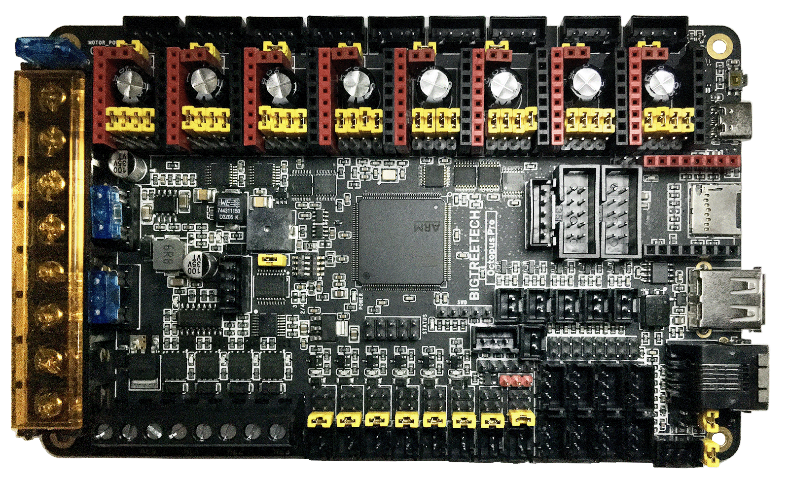
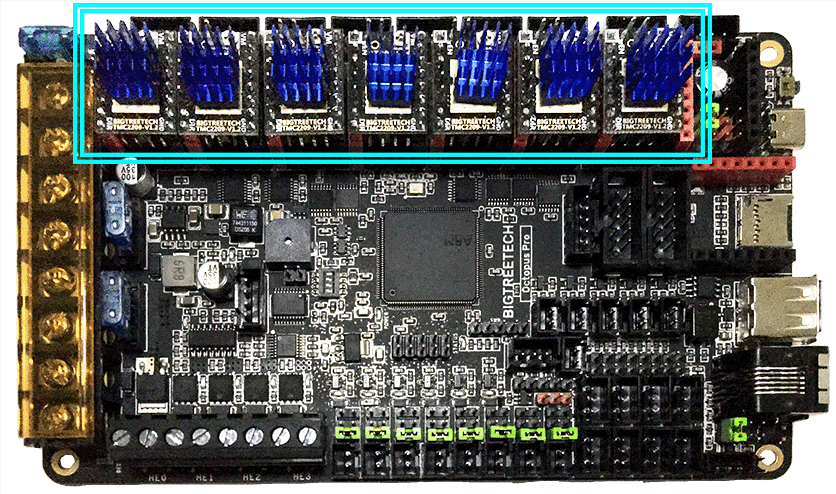
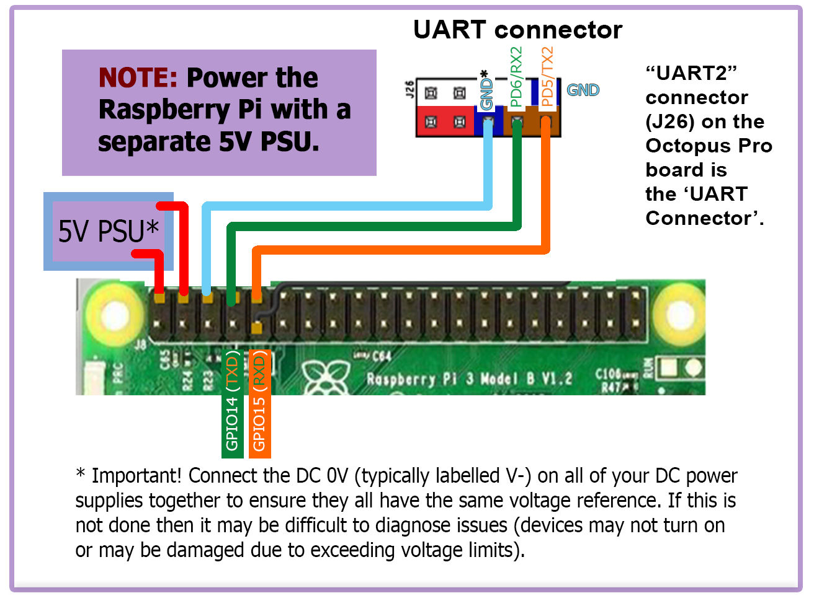

# BTT Octopus Pro V1.0 in UART Mode

## Initial Removal of Jumpers for UART Mode

Remove **all YELLOW** on-board jumpers, located at the positions shown below.

<!--
To be able to supply the Voron user and Voron Helper staff with an easy access LINK for all diagrams, I tested
a couple of different methods.  I found one method that allowed the user to left-click on the diagram
and it would open the diagram up in the web browser. I choose to not use this method because ther would be
a lot of Voron users who probably would activate this by accident and then not beable to get themselves back.

The method I choose was one that will display the LINK symbol to the left of the diagram and without adding
any title text. I ended up using header 6 with a blank title and then I use a Kramdown Syntax for specifying
a Header ID.

If I use the GFM Parser for creating a header anchor with an empty title the static web page produced
DOES NOT show the LINK symbol to the left of the diagram. The Link is setup but only I can use it in the
web page code. An outside Voron Helper could not access the Link Address.  The GFM Parser syntax for "header anchors" forces you to use a text in the title.  If you use a title text then the LINK symbol will be generated.

But with further reading I found that Kramdown Parser does allow a "title text of empty" which produces the LINK symbol to the left of the diagram and generates the LINK address that Voron Users and Voron Helpers can access by right-clicking on the LINK symbol. The documentation for this can be found at https://kramdown.gettalong.org/syntax.html#headers ; look for "Specifying a Header ID"
-->

######  {#Octopus_Pro_PREP-Removal_UART}
{:.no_toc}

[Go Back to the Table of Contents](v2_octopus_pro_uartspi_wiring.html#table-of-contents)

## Initial Preparation for UART Mode - Set Jumpers

* Ensure the jumpers of "DIAG Jumper Block" are all removed to avoid the influence of TMC2209 DIAG on the endstop.

* Ensure the removal of the USB 5V power supply jumper ("Power Selection Jumper") which avoids the interaction between the USB 5V of Raspberry Pi and the DC-DC 5V of the motherboard.

* Set the on-board jumpers, located at the positions as shown by the **GREEN** jumpers in the diagram below:

######  {#Octopus_Pro_F446_UART_Mode_for_Prep_150}
{:.no_toc}

[Go Back to the Table of Contents](v2_octopus_pro_uartspi_wiring.html#table-of-contents)

### (FAN & MOTOR POWER & PROBE) Voltage Selection Headers

* In the diagram below, the **COLORED BOXES** indicate the headers with **GREEN** jumpers which are set for 24VDC.

* In the diagram below, the **BLUE box** indicates the "fan voltage selection headers" with **GREEN** jumpers which are set for 24VDC.

    * __IMPORTANT:__ **If fans that use 5VDC or 12VDC are used, please take NOTE of these "fan voltage selection headers" and set the jumpers to the appropriate jumper position so that the correct fan voltage will be produced to run the 5VDC or 12VC fan.  If the fan voltage selection jumper is set for 24VDC and a 5VDC/12VDC fan is connected to it, the Octopus Pro board will be damaged.**

* In the diagram below, the **ORANGE box** indicates the "probe voltage selection header" with a **GREEN** jumper which is set for 24VDC. If a PROBE voltage of 5VDC or 12VDC is desired, this jumper needs to be changed. If the voltage required by the PROBE device does not match the voltage selected by the "probe voltage selection Jumper" then the Octopus Pro board could be damaged.

* In the diagram below, the **ORANGE box made with a dash line** indicates the PT100/PT1000 DIP switches. The default setting of all the DIP switches is set to OFF. This default setting is undefined.  Therefore, **before you install the Octopus Pro board, a valid setting must be chosen.  Choose between a 2-wire or 4-wire arrangement: ([2-wire: 7, 11] or [4-wire: 4, 8])**

* In the diagram below, the **YELLOW box** indicates the motor power selection headers with **GREEN** jumpers which are set for 24VDC.  Each stepper motor driver has this header so that each individual socket can be set to either 24VDC (Vin) or MOTOR_POWER voltage.

    * __IMPORTANT:__ **If the motor power selection headers DO NOT match the voltage being supplied to the stepper driver, the Octopus Pro board will be damaged along with the stepper motor driver.  Set each of the motor power selection jumpers to the appropriate position so that the stepper driver _voltage needed, matches the PSU voltage selected_ by the motor power selection jumper. For example, If the stepper motor driver voltage is set for 48VDC and the actual stepper motor driver runs at 12VDC, the Octopus Pro board and the stepper motor driver will be damaged.**

* __IMPORTANT:__ **Double check all the** __GREEN__ **jumpers are set appropriately, especially the jumpers called out by the _COLORED BOXES_, BEFORE the power supply is connected.**

[Go Back to the Table of Contents](v2_octopus_pro_uartspi_wiring.html#table-of-contents)

### (FAN & MOTOR POWER & PROBE) Voltage Selection Diagram
{:.no_toc}

######  {#Octopus_Pro_F446_UART_VoltageSelect}
{:.no_toc}

[Go Back to the Table of Contents](v2_octopus_pro_uartspi_wiring.html#table-of-contents)

## Stepper Motor Drivers
* Inspect the stepper motor drivers for left over rosin, and clean with IPA, if needed
* Install heat sinks on all stepper motor drivers

## MCU Wiring for UART Mode 

* Connect 24V and GND (V+ and V-) from the PSU to PWR and MOTOR_POWER
* Connect stepper driver for the B Motor (gantry left) into position DRIVER0
* Plug in stepper motor for the B Motor (gantry left) into position MOTOR0
* Connect stepper driver for the A Motor (gantry right) into position DRIVER1
* Plug in stepper motor for the A Motor (gantry right) into position MOTOR1
* Connect stepper driver for the Z into positions DRIVER2
* Plug in stepper motor for the Z into positions MOTOR2_1
* Connect stepper driver for the Z1 into positions DRIVER3
* Plug in stepper motor for the Z1 into positions MOTOR3
* Connect stepper driver for the Z2 into positions DRIVER4
* Plug in stepper motor for the Z2 into positions MOTOR4
* Connect stepper driver for the Z3 into positions DRIVER5
* Plug in stepper motor for the Z3 into positions MOTOR5
* Connect stepper driver for the extruder motor into position DRIVER6
* Plug in stepper motor for the extruder motor into position MOTOR6
* Connect the hot end heater to HE0 (PA2)
* Connect the bed SSR (DC Control Side) to HE1 (PA3)
* Connect the part cooling fan to FAN0 (PA8)
* Connect the hot end fan to FAN1 (PE5)
* Connect the controller fans to FAN2 (PD12)
* Connect the chamber exhaust fan to FAN3 (PD13)
* Connect the hot end thermistor to T0 (PF4)
* Connect the bed thermistor to TB (PF3)
* Connect the X endstop to STOP_0 (PG6)
* Connect the Y endstop to STOP_1 (PG9)
* Connect the Z endstop to STOP_2 (PG10)
* Connect the signal wire on the PROBE to STOP_7 (PG15)
* Connect the V+ an 0V wires on the probe to PROBE
* if using a mini12864 display, connect to EXP1 & EXP2, only after completing the steps shown [below](#mini-12864-display)

[Go Back to the Table of Contents](v2_octopus_pro_uartspi_wiring.html#table-of-contents)

## MCU Wiring Diagram for UART Mode
   

######  {#Voron2_Wiring_Diagram_Octopus_ProF446_V1_UART}
{:.no_toc}

* If you want to open the above diagram, in a new tab of your web browser, and have the ability to zoom and download the diagram in JPG format then [click here](./images/Voron2_Wiring_Diagram_Octopus_ProF446_V1_UART_150.jpg){:target="_blank" rel="noopener"}

[Go Back to the Table of Contents](v2_octopus_pro_uartspi_wiring.html#table-of-contents)

## Please Ensure the Heat Sinks are Installed Before Use
{:.no_toc}
### MCU in UART Mode with Heat Sinks Installed
{:.no_toc}
   

######  {#Octopus_Pro_UART_Heatsinks}
{:.no_toc}

[Go Back to the Table of Contents](v2_octopus_pro_uartspi_wiring.html#table-of-contents)

## Raspberry Pi

### Power
* The Octopus Pro is capable of providing 5V power to run your Raspberry Pi.  To take advantage of this feature, connect the wires as shown below, from the pi header of the Octopus Pro, to the GPIO header of the Pi.
* Use at least 24awg wire for this connection.  It may be tempting to use the common "Dupont" jumpers found in many electronics kits, however these jumpers typically use very small gauge wire, and will not carry enough current to run the Pi.
* Tie all the DC 0V (typically labelled V-) lines for all the DC power supplies together to ensure that all power supplies have the same voltage reference.

######  {#v2_octopus_pro_pi_onlyPWR_1}
{:.no_toc}

[Go Back to the Table of Contents](v2_octopus_pro_uartspi_wiring.html#table-of-contents)

### Connection Using Separate Power Supply
* To reduce the current load on the 5V rail of the Octopus Pro board, the Raspberry Pi can be powered by an independent power supply.
* Use at least 24awg wire for V+ and GND connections to the Pi's power supply
* Tie all the DC 0V (typically labelled V-) lines for all the DC power supplies together to ensure that all power supplies have the same voltage reference.

######  {#v2_octopus_Pro_to_PI_UART_1}
{:.no_toc}

[Go Back to the Table of Contents](v2_octopus_pro_uartspi_wiring.html#table-of-contents)

### Control
{:.no_toc}
* Voron Design recommends using USB to control the Octopus Pro, which simply requires connecting a USB-A to USB-C cable between the Octopus Pro and Pi.
* The option also exists to use a UART connection from the Pi header, in place of the USB.  If you prefer this option, please see the wiring diagram located above in [Connection Using Separate Power Supply](#connection-using-separate-power-supply) and use the instructions below on the Raspberry Pi.  You will want to perform the instructions below **after Mailsail/Fluidd is installed on the Raspberry Pi.**

######  {#ConnectPitoOctopusPro-Instructions_1}
{:.no_toc}

[Go Back to the Table of Contents](v2_octopus_pro_uartspi_wiring.html#table-of-contents)

## SSR Wiring for UART Mode

* Wire colors will vary depending on your locale.

######  {#BTTOctopus_Pro-ssr-UART-wiring}
{:.no_toc}

* If you want to open the above diagram, in a new tab of your web browser, and have the ability to zoom and download the diagram in PNG format then [click here](./images/BTTOctopus_Pro-ssr-UART-wiring.png){:target="_blank" rel="noopener"}

[Go Back to the Table of Contents](v2_octopus_pro_uartspi_wiring.html#table-of-contents)

## mini 12864 Display

* See [the mini12864 guide](./mini12864_klipper_guide.md)

## The Klipper Configuration file for BTT Octopus Pro V1.0 Board

* The Klipper Configuration file from VoronDesign/Voron-2 GitHub Repo for BTT Octopus Pro 1.0 board is [located here](https://github.com/VoronDesign/Voron-2/blob/Voron2.4/firmware/klipper_configurations/Octopus/Voron2_Octopus_Config.cfg){:target="_blank" rel="noopener"}

[Go Back to the Table of Contents](v2_octopus_pro_uartspi_wiring.html#table-of-contents)

## Color PIN Diagram for BTT Octopus Pro V1.0

For reference, here is the Color PIN diagram for the BTT Octopus Pro V1.0

######  {#BTT-Octopus-Pro-V1.0-color-PIN_1}
{:.no_toc}

* If you want to open the above diagram, in a new tab of your web browser, and have the ability to zoom and download the diagram in PDF format then [click here](./images/BTT-Octopus-Pro-V1.0-Color-PIN-V3.0.pdf){:target="_blank" rel="noopener"}

* If you want to open the above diagram, in a new tab of your web browser, and have the ability to zoom and download the diagram in JPG format then [click here](./images/BTT-Octopus-Pro-V1.0-color-PIN-V3.0.jpg){:target="_blank" rel="noopener"}

[Go Back to the Table of Contents](v2_octopus_pro_uartspi_wiring.html#table-of-contents)

## Original BTT Octopus Pro V1.0 Pinout

For reference, here is the original pinout of the BTT Octopus Pro V1.0

* Note: If you see a conflict between the original pinout and any other source, please refer back to the [BTT Octopus Pro V1.0 schematic diagram](<./images/BIGTREETECH Octopus Pro_SCH.pdf>){:target="_blank" rel="noopener"}

######  {#BIGTREETECH_Octopus_Pro-PIN-original_1}
{:.no_toc}

* If you want to open the above diagram, in a new tab of your web browser, and have the ability to zoom and download the diagram in PDF format then [click here](<./images/BIGTREETECH Octopus Pro - PIN.pdf>){:target="_blank" rel="noopener"}

[Go Back to the Table of Contents](v2_octopus_pro_uartspi_wiring.html#table-of-contents)

## The BTT's GitHub Repo for the Octopus Pro V1.0 board

* BTT's documentation for Octopus Pro V1.0 board is [located here](https://github.com/bigtreetech/BIGTREETECH-OCTOPUS-Pro){:target="_blank" rel="noopener"}

## After I have Wired up the MCU Board, What Comes Next?   
   

   Once the MCU board is wired up and wire management has been performed, the next step is to compile and install the Klipper Firmware, please see [The Build ═► Software Installation](../../build/software/index.md#software-installation)

   Once the MCU board has the Klipper Firmware Installed, the next step is to edit the Klipper Config file (Voron2_Octopus_Config.cfg) to ensure your Voron build matches your Klipper Config file, please see [The Build ═► Software Configuration](../../build/software/configuration.md#software-configuration).  Please use the Color PIN Diagrams, [displayed above](#color-pin-diagram-for-btt-octopus-pro-v10), as a source of information.

   After editing the Klipper Config file (Voron2_Octopus_Config.cfg), the next step is to check all the Motors and the mechanics of the Voron printer, please see [The Build ═► Initial Startup Checks](../../build/startup/index.md#initial-startup-checks)

[Go Back to the Table of Contents](v2_octopus_pro_uartspi_wiring.html#table-of-contents)
