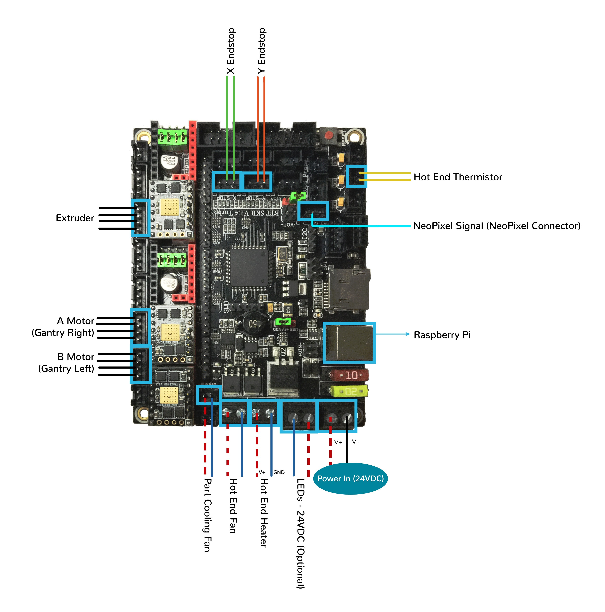
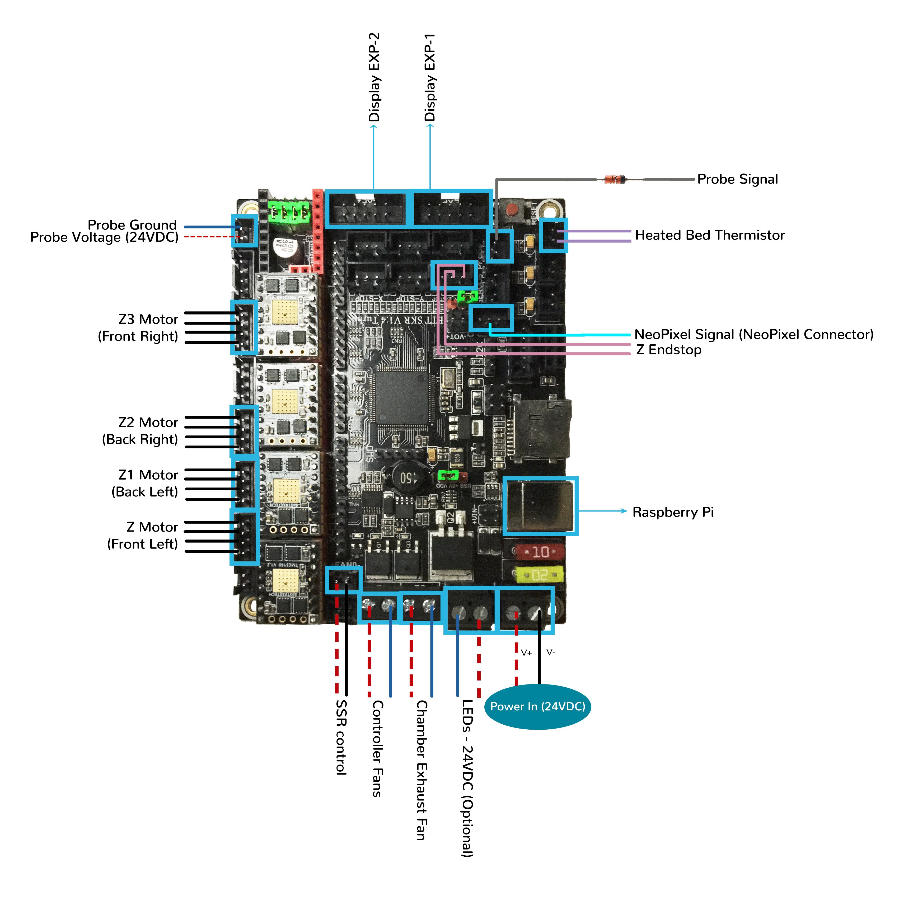
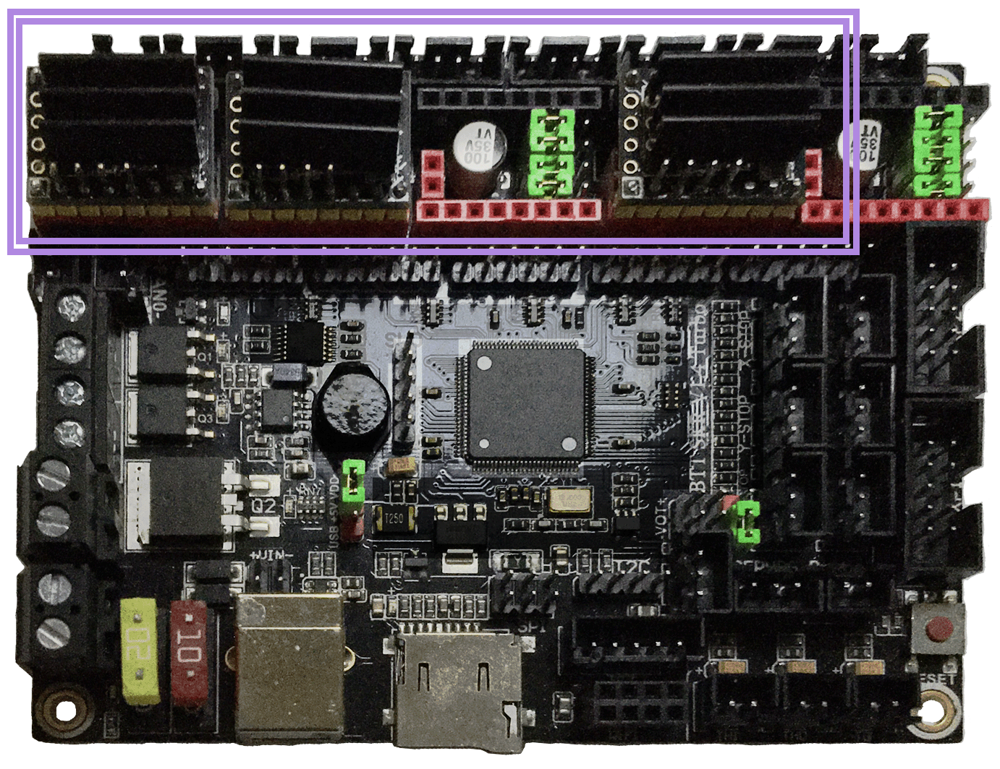
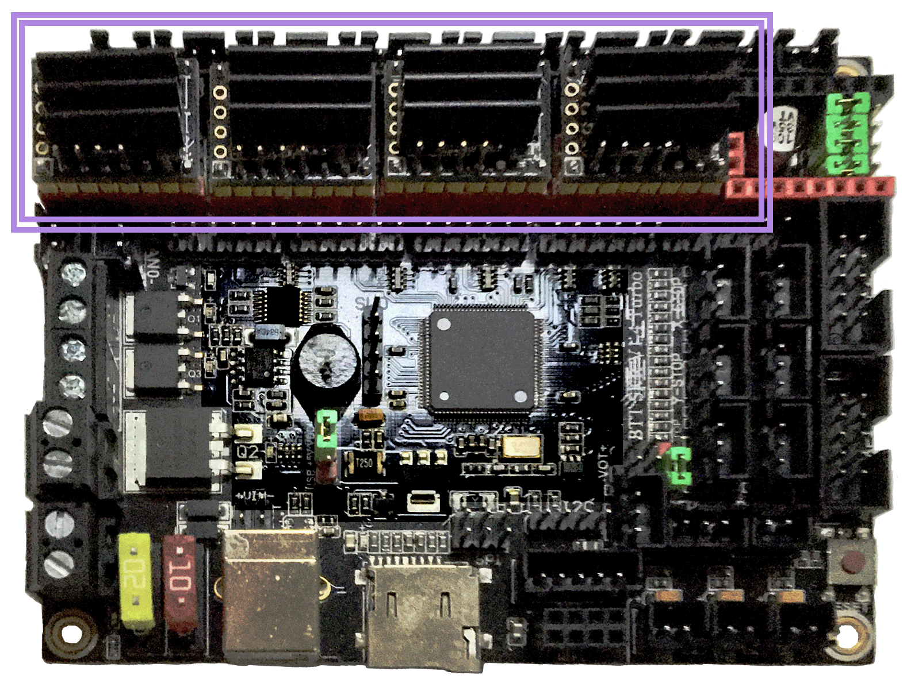
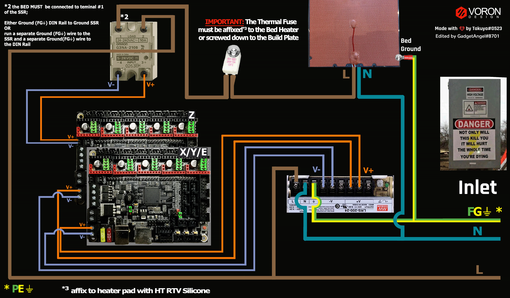

# Voron V2 - SKR V1.4/Turbo (TMC2100, TMC2130, TMC5160, TMC5161, TMC5160HV, TMC5160_PRO) Wiring

## Initial Preparation Needed for TMC2130, TMC5160 or TMC5161 (TMCxxxx drivers with StallGuard) SPI Stepper Motor Drivers
   

* See [the Initial Preparation for TMC2130, TMC5160 or TMC5161 Drivers](./skrv14init_prep_tmc_drvs_spi#preparation-of-tmc2130-tmc5160-or-tmc5161-stepper-motor-drivers){:target="_blank" rel="noopener"}

## Initial Removal of Jumpers for SPI Mode

We have no idea what state your board is in when you start this process.  Someone could have moved jumpers around already.  But since we are here, on the SPI end of the site, then I assume that you might want to look at the next section **before** removing **all the jumpers** because if all the jumpers are already set for SPI mode then removing them and placing them right back in would be a waste of your valuable time.

**If one does not understand what I mean by "if the jumpers are set for SPI" then I would recommend that removing all the jumpers would be the place to start.**

Remove **all YELLOW** on-board jumpers, located at the positions shown below:

######  {#v2_skrv14_PREP-removal_spi_v2}

## Initial Preparation for SPI Mode - Set Jumpers

* Set the on-board jumpers, located at the positions as shown by the **GREEN** jumpers in the diagram below:

######  {#v2_skr14T_SPI_PREP_1_v2}

* If you want to open the above picture, in a new tab of your web browser, then [click here](./images/v2_skr14T_SPI_PREP.png){:target="_blank" rel="noopener"}

### Voltage Selection Headers

* **Set the USB-PWR jumper to the VDD position (as shown in the PURPLE box)** to avoid the interaction between the USB 5V of Raspberry Pi and the DC-DC 5V of the motherboard.

* The NPWR jumper setting will decide the source of the board's NeoPixel connector's +V PIN.  The NeoPixel connector can be sourced from the board itself or from an external DCDC bridge module.  One can purchase an external DCDC bridge module (sold separately) to power 5V NeoPixel LEDs.  This bridge module is called the "DCDC Mode V1.0" board. Since the Voron printer does not require the extra DCDC bridge module, **set the NPWR jumper to indicate that the DCDC bridge module is not attached to the board, as shown in the ORANGE box on the diagram below.**

__IMPORTANT:__ **Double check all the** __GREEN__ **jumpers are set appropriately, especially the jumpers called out by the _COLORED BOXES_, BEFORE the power supply is connected.**

######  {#v2_skr14T_SPI_voltageselect_v2}

* If you want to open the above picture, in a new tab of your web browser, then [click here](./images/v2_skr14T_SPI_voltageselect.png){:target="_blank" rel="noopener"}

## Stepper Motor Drivers
* - [ ] Inspect the stepper motor drivers for left over rosin, and clean with IPA, if needed
* - [ ] Before installing heat sinks on to the stepper motor drivers,&nbsp;[please read this](#please-ensure-the-heat-sinks-are-installed-before-use)
* - [ ] Install heat sinks on all stepper motor drivers

## MCU X/Y/E, Hot End in SPI Mode

* - [ ] Connect 24V and GND (V+ and V-) from the PSU to Power In
* - [ ] Connect stepper driver for the B Motor (gantry left) into position X (driver socket)
* - [ ] Plug in stepper motor for the B Motor (gantry left) into position X (motor connector)
* - [ ] Connect stepper driver for the A Motor (gantry right) into position Y (driver socket)
* - [ ] Plug in stepper motor for the A Motor (gantry right) into position Y (motor connector)
* - [ ] Connect stepper driver for the extruder motor into position E0 (driver socket)
* - [ ] Plug in stepper motor for the extruder motor into position E0 (motor connector)
* - [ ] Connect the hot end heater to HE0 (P2.7)
* - [ ] Connect the part cooling fan to FAN0 (P2.3)
* - [ ] Connect the hot end fan to HE1 (P2.4)
* - [ ] Connect the hot end thermistor to TH0 (P0.24)
* - [ ] Connect the X endstop to X-STOP (P1.29)
* - [ ] Connect the Y endstop to Y-STOP (P1.28)
* - [ ] Connect USB Cable to your SKR 1.4/Turbo,&nbsp; **but do not connect it yet to your Raspberry Pi**

### MCU X/Y/E, Hot End in SPI Mode Wiring Diagram

######  {#v2tri_Wiring_Diagram_skrv14T_XYE_SPI_v2}

* If you want to open the above diagram, in a new tab of your web browser, and have the ability to zoom and download the diagram in JPG format then [click here](./images/v2tri_Wiring_Diagram_skrv14T_XYE_SPI.jpg){:target="_blank" rel="noopener"}

## MCU Z, Bed, Exhaust Fan in SPI Mode

* - [ ] Connect 24V and GND (V+ and V-) from the PSU to Power In
* - [ ] Connect stepper driver for the Z into positions X (driver socket)
* - [ ] Plug in stepper motor for the Z into positions X (motor connector)
* - [ ] Connect stepper driver for the Z1 into positions Y (driver socket)
* - [ ] Plug in stepper motor for the Z1 into positions Y (motor connector)
* - [ ] Connect stepper driver for the Z2 into positions Z (driver socket)
* - [ ] Plug in stepper motor for the Z2 into positions Z_1 (motor connector)
* - [ ] Connect stepper driver for the Z3 into positions E0 (driver socket)
* - [ ] Plug in stepper motor for the Z3 into positions E0 (motor connector)
* - [ ] Connect the bed SSR (DC Control Side) to FAN0 (P2.3)
* - [ ] Connect the controller fans to HE1 (P2.4)
* - [ ] Connect the chamber exhaust fan to HE0 (P2.7)
* - [ ] Connect the heated bed thermistor to TB (P0.25)
* - [ ] Connect the Z endstop to Z-STOP (P1.27)
* - [ ] Connect the Probe Signal (with&nbsp;**BAT85 diode**) to PROBE connector (P0.10)
* - [ ] Connect the Probe PWR and GND to FAN2
* - [ ] Connect USB Cable to your SKR 1.4/Turbo,&nbsp; **but do not connect it yet to your Raspberry Pi**

BAT85
: a Schottky barrier diode. BAT85 is needed to protect the SKR board (MCU board) from being fried.  An Inductive Probe device (Omron TL-Q5MC2; Omron TL-Q5MC2-Z or Panasonic GX-HL15BI-P) communicates at a much higher voltage level (10V - 30V) then the MCU board.  The BAT85 is used to protect the input signal PIN of the MCU board; without the BAT85 the MCU board will be damaged.  If two BAT85s are used in series, the circuit will protect the MCU board and still allow the inductive probe to function properly. [For more information, click here](../../../build/electrical/index#bat85-diode){:target="_blank" rel="noopener"}

### MCU Z, Bed, Exhaust Fan in SPI Mode Wiring Diagram

######  {#v2_Wiring_Diagram_skrv14T_Z_SPI_v2}

* If you want to open the above diagram, in a new tab of your web browser, and have the ability to zoom and download the diagram in JPG format then [click here](./images/v2_Wiring_Diagram_skrv14T_Z_SPI.jpg){:target="_blank" rel="noopener"}

## Please Ensure the Heat Sinks are Installed Before Use

Note on the Orientation of the Stepper Motor Driver's Heat Sinks
: Place the heat sinks for the stepper motor drivers so that the orientation of the fins on the heat sinks are parallel to the air flow from the controller fans once the MCU board is installed on the DIN rail. Ensure the heat sinks are **not touching** the solder joints located on the top of the step stick. Please note, that your placement of heat sinks may be different from the orientation shown below.

### MCU X/Y/E, Hot End with Heat Sinks Installed

######  {#v2_skr14T_SPI_heatsinks1_v2}

### MCU Z, Bed, Exhaust Fan with Heat Sinks Installed

######  {#v2_skr14T_SPI_heatsinks2_v2}

## Raspberry Pi

### Power
* The BTT SKR V1.4/Turbo board is **NOT capable of providing 5V power** to run your Raspberry Pi.

## Setting up UART Serial Communications with the Raspberry Pi

* see [the SKR V1.4/Turbo Raspberry Pi Section](../../../build/electrical/skrv14_RaspberryPi#raspberry-pi){:target="_blank" rel="noopener"}

## SSR Wiring (Board Shown is in SPI mode)

* Wire colors will vary depending on your locale.

######  {#two_skrv1.4inSPI-ssr-wiring_spi_v2}

* If you want to open the above diagram, in a new tab of your web browser, and have the ability to zoom and download the diagram in PNG format then [click here](./images/two_skrv1.4inSPI-ssr-wiring.png){:target="_blank" rel="noopener"}

### The Klipper Configuration file for SKR V1.4/Turbo board (UART mode - SPI mode needs to be added to this)

The Klipper Configuration file from VoronDesign/Voron-2 GitHub Repo for SKR V1.4/Turbo board is [located here](https://raw.githubusercontent.com/VoronDesign/Voron-2/Voron2.4/firmware/klipper_configurations/SKR_1.4/Voron2_SKR_14_Config.cfg){:target="_blank" rel="noopener"};

## URL Resources Links for the SKR V1.4/Turbo (PIN Diagrams and Repo)

* see [The SKR V1.4/Turbo Resource Section](../../../build/electrical/skrv14_Resources#color-pin-diagram-for-skr-v14v14turbo){:target="_blank" rel="noopener"}

## After I have Wired up the MCU Board, What Comes Next?

1. Once the MCU board is wired up and wire management has been performed, the next step is to install Mainsail/Fluidd or Octoprint, please see [The Build ═► Software Installation](../../../build/software/index#software-installation){:target="_blank" rel="noopener"}

2. Once Mainsail/Fluidd or Octoprint has been installed, the next step is to **compile and install** the Klipper Firmware, please see [The Build ═► Software Installation -> Firmware Flashing(Header) -> SKR 1.4](../../../build/software/skr13_klipper#skr-1314-klipper-firmware){:target="_blank" rel="noopener"}

3. Once the MCU board has the Klipper Firmware Installed, the next step is to **create/edit** the Klipper Config file (Voron2_SKR_14_Config.cfg rename it to printer.cfg and replace UART with SPI). Please see [the file located here; Select "V2 SKR 1.4"](../../../build/software/configuration#initial-voron-printer-configuration){:target="_blank" rel="noopener"} as a good starting point;

    * Please use the Color PIN Diagrams, [displayed here](../../../build/electrical/skrv14_Resources#color-pin-diagram-for-skr-v14v14turbo){:target="_blank" rel="noopener"}, as a source of information;

    * Please consult [The Build ═► Software Configuration](../../../build/software/configuration#software-configuration){:target="_blank" rel="noopener"} on how to edit the Klipper Config file.

4. After **creating/editing** the Klipper Config file (Voron2_SKR_14_Config.cfg renamed to printer.cfg), the next step is to check all the Motors and the mechanics of the Voron printer, please see [The Build ═► Initial Startup Checks](../../../build/startup/index#initial-startup-checks){:target="_blank" rel="noopener"}

